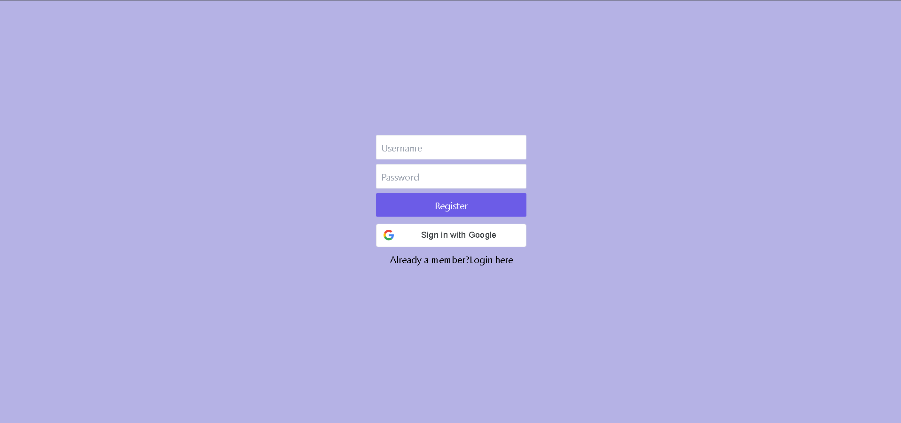
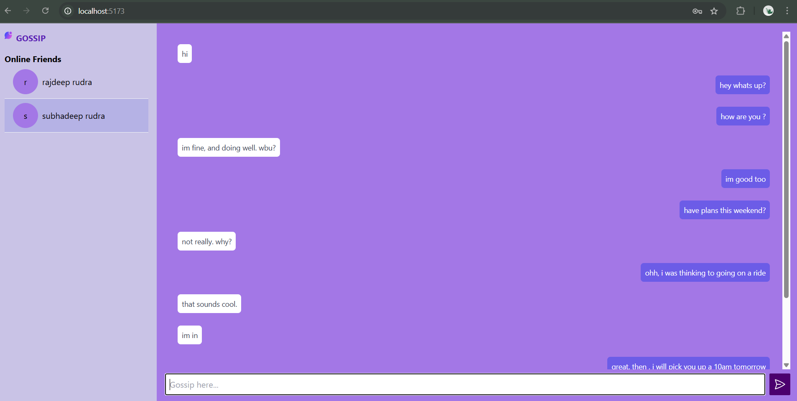

#  Gossip - Real-time Chat Application

**Gossip** is a real-time chat application built using the MERN stack (MongoDB, Express.js, React.js, Node.js) and WebSockets. It allows users to sign up, log in securely using JWT, see online friends, and chat in real time with message persistence using MongoDB.

---

## 🌟 Features

- 🔐 **Authentication**
  - User signup and login with secure JWT token-based authentication
- 💬 **Real-time Messaging**
  - Bi-directional communication using WebSockets (WS)
- 🧑‍🤝‍🧑 **Online Friends Detection**
  - Displays a list of currently online users (excluding yourself)
- 💾 **Message Persistence**
  - All messages are stored in MongoDB 
- ✨ **Modern UI**
  - Clean and responsive interface with TailwindCSS


---

## 🛠️ Tech Stack

| Frontend            | Backend             | Database            | Auth        | Real-Time      |
|---------------------|---------------------|----------------------|-------------|----------------|
| React.js, Axios, TailwindCSS | Node.js, Express.js | MongoDB Atlas       | JWT         | WebSocket      |

---

## 📦 Installation & Setup

### 1. Clone the repository

```bash
git clone https://github.com/your-username/gossip-chat-app.git
cd gossip-chat-app
```

### 2. Setup Backend (Node + Express + WebSocket)

```bash
cd api
npm install
```

Create a `.env` file inside `backend/` and add:

```env
MONGODB_URI=YOUR MONGO URL
JWT_SECRET="YOUR SECTER KEY"
PORT=4040
CLIENT_URL=" http://localhost:5173"
```

Start the backend server:

```bash
node index.js
```

### 3. Setup Frontend (React)

```bash
cd ../client
npm install
yarn dev
```

Make sure the frontend is pointing to the backend URL (`localhost:4040` or your deployed backend).

---


## 📂 Folder Structure

```
/frontend       -> React frontend (UI)
/backend        -> Node.js backend with WebSocket server
```

---

## ✅ Upcoming Features

- 📸 Image and file sharing
- 🧵 Group chats
- ✅ Read receipts
- 🕘 Message timestamps

---

## 📸 Screenshots

## 🖼️ Preview





---

## 🧑 Author

- **Rajdeep Rudra**
- GitHub: [@rajdeeprudra](https://github.com/your-username)
- LinkedIn: [linkedin.com/in/your-link](https://linkedin.com/in/your-link)

---


##  Support

If you like this project, consider giving it a ⭐ on [GitHub](https://github.com/your-username/gossip-chat-app)!
